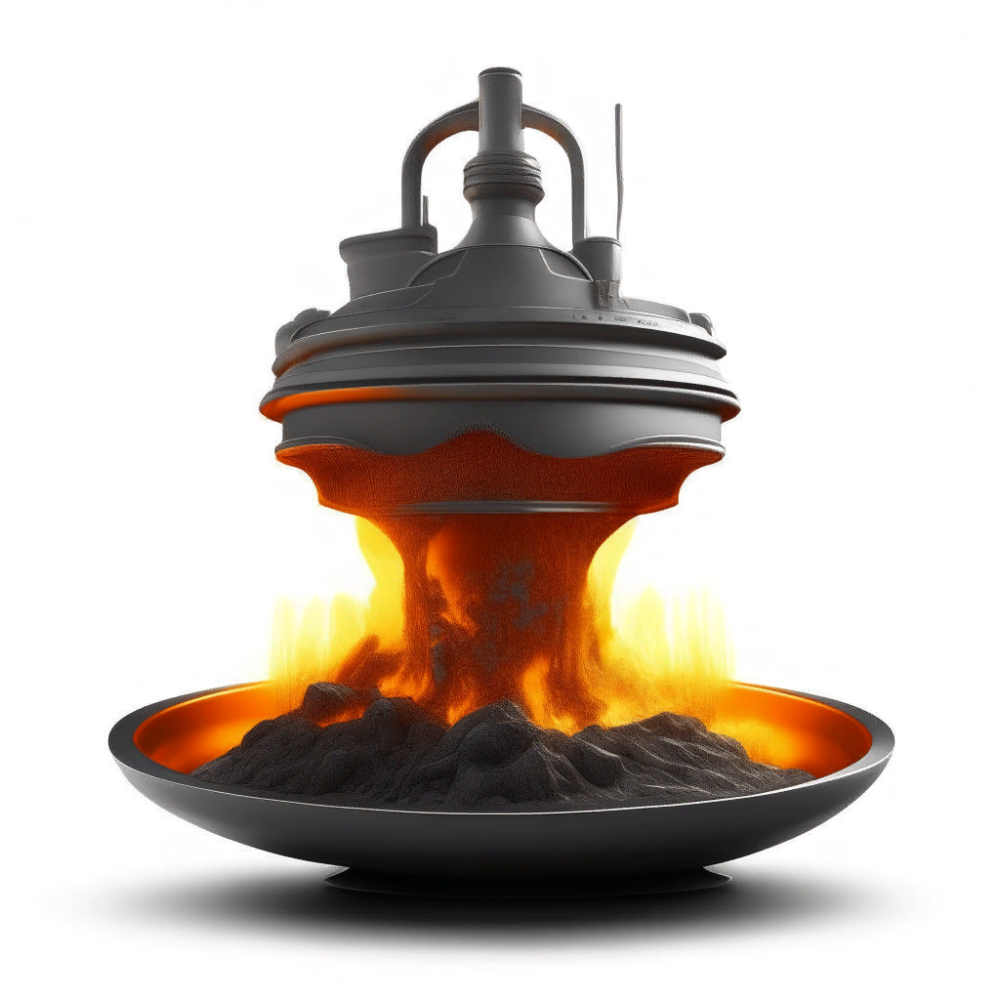

<table border="1" width="100%" cellpadding="40" cellspacing="10"><tbody>
  <tr>
    <td width="20%" align="center">
      
    </td>
    <td valign="top">
      <h3>Прогнозирование температуры расплава стали после окончания стадии легирования</h3>
       <i>Forecasting the Steel Melting Temperature at the End of the Alloying Stage</i>
    </td>
  </tr>
  <tr>
    <td valign="top">
      

[Смотреть](https://nbviewer.org/github/georgiy-vasilevskiy/test_repo/blob/main/Forecasting_the_Steel_Melting_Temperature_at_the_End_of_the_Alloying_Stage.ipynb)
    <td>
      text
    </td>
  </tr>
</tbody></table>

Современное производство стали использует большое количество электрической энергии. Большая её часть идёт на нагрев и плавление сырья и вспомогательных реагентов, а также на поддержание температуры расплава на заданном уровне. Снижение уровня потребления электроэнергии позволит снизить расходы на неё, что приведёт к сокращению затрат на производство стали, снижению её себестоимости и, как следствие, повышению конкурентоспособности продукции металлургического предприятия.

<a taget="_blank" title="Использовать nbviewer" href="https://nbviewer.org/github/georgiy-vasilevskiy/test_repo/blob/main/Forecasting_the_Steel_Melting_Temperature_at_the_End_of_the_Alloying_Stage.ipynb">Смотреть</a>

 

